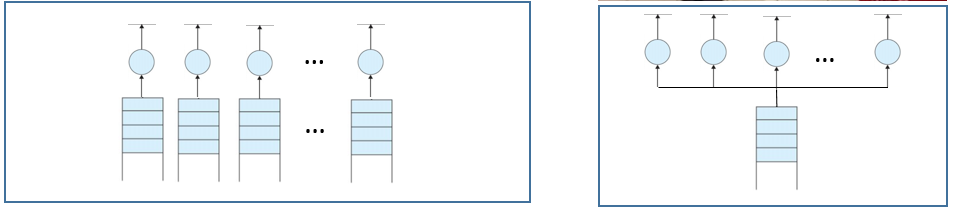
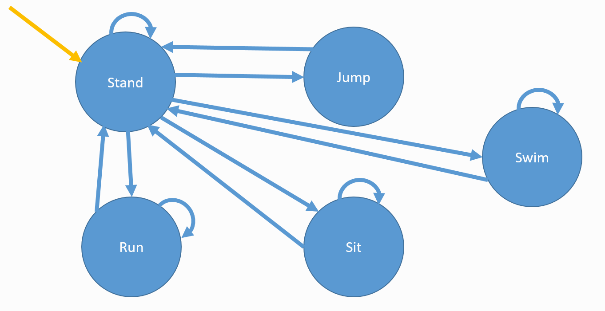

# Assignment 4 - DES (Queuing Theory, State Diagrams, and Markov Processes)
Discrete-event Simulation Assignment

> * Participant name: Anthony Mompoint

## General Introduction

Discrete event modeling is the process of depicting the behavior of a complex system as a series of well-defined and ordered events. A discrete-event simulation (DES) simulates the operation of the system model as a discrete sequence of events in time. Each event occurs at a particular instant in time and marks a change of state in the system. Discrete-event simulation is used to simulate components that normally operate at a higher level of abstraction than components simulated by continuous simulators.

This assignment will look at two DES systems:
* Queues (*Target vs. Kohls*)
* State Diagrams

## Part 1 - Queues (AnyLogic) - (65%)

Queuing theory deals with problems that involve queuing (or waiting). Typical examples might be:
* banks/supermarkets - waiting for service
* computers - waiting for a response
* failure situations - waiting for a failure to occur e.g. in a piece of machinery
* public transport - waiting for a train or a bus

As we know queues are a common every-day experience. Queues form because resources are limited. In designing queueing systems we need to aim for a balance between service to customers (short queues implying many servers) and economic considerations (not too many servers). Note here that integral to queuing situations is the idea of uncertainty in, for example, interarrival times and service times. This means that probability and statistics are needed to analyze queuing situations. Typically we can talk of this individual sub-system as dealing with customers queuing for service

* Read and follow along with the [**Bank Office (Queueing System Tutorial)**](https://anylogic.help/tutorials/bank-office/index.html) from the [**AnyLogic Help**](https://help.anylogic.com) -- tutorials page. 
This tutorial explains very well where the features are and some insight where and what is built into AnyLogic.
* Review the [**Probability Distributions**](https://anylogic.help/anylogic/stochastic/probability-distributions.html) found in AnyLogic Help -- Advanced Modeling with Java -- Probability Distributions (* I Personally found this oddly buried in the help docs...*)
* Review the [**Process Modeling Library**](https://help.anylogic.com/index.jsp?nav=%2F2_0) - specifically I would focus on the [Process Modeling Library blocks](https://help.anylogic.com/topic/com.anylogic.help/html/_ProcessModeling/PML_Blocks.html?cp=2_0_1) since it has helpful documentation on the queue features.
* [**Collecting Output Data**](https://anylogic.help/anylogic/analysis/output.html) has some good information about [Statistics](https://anylogic.help/anylogic/data/collections-statistics-api.html#:~:text=AnyLogic%20provides%20functions%20to%20collect%20statistics%20on%20elements,global%20%28accessible%20from%20each%20place%20of%20model%20code%29.) and other output data features.

**(A)**.  We will be looking at the queues from Assignment 3's seaport container terminal system(s). Therefore, it is important that these terminals operate optimally to reduce costs and increase cargo flow. For this assignment, we assume this seaport terminals system operates in four subsystems: (1) routing, scheduling, and queuing ships to available berths; (2) waterside ship berth container unloading; (3) landside container yard storage; and (4) landside container shipping through trucks and trains.

> * **For this part of the assignment you will evaluate both models (in AnyLogic) and motivate which model is better and why but comparing the simulations of the models.**
> * Assign cost values to the trucks operating. 
> * Track and visualize metrics of the two systems. Write up your findings. For example - some metrics may include queue length, truck utilization, cost, and the number of trucks active (or idle) in the system...
> * (We expect a good write up on this looking at the graphs AnyLogic can produce.)

We will first look at two different approaches to moving cargo off the ships - first each birth will have its own queue of trucks to move the containers to the shipyard. Second, there will be a single line and the trucks will go to the next available berth. Both models are visualized below.
 

Some features you might want to look at:
* Different arrival and service times - and how that affects both systems. Do the systems react differently when saturated.
* How long does a customer expect to wait in the queue before they are served, and how long will they have to wait before the service is complete?
* What is the probability of a customer having to wait longer than a given time interval before they are served?
* What is the average length of the queue?
* What is the probability that the queue will exceed a certain length? (think holiday season/black Friday)
* What is the expected utilization of the server and the expected time period during which he will be fully occupied (remember servers cost us money so we need to keep them busy - I mined the hourly data from glassdoor.com above). 
* In fact if we can assign costs to factors such as customer waiting time and server idle time then we can investigate how to design a system at minimum total cost.

The graphs below show a histogram with percentage of likelyness to be waiting for a specific amount of time and the average wait time for a container after entering a specific berth. The graph on the right shows the average queue size of each berth(each berth of a max queue size of 20). The bottom graph shows the average vehicle utilization of each vehicle, for single queue that is total, and for multi queue that is for each berth. 

**With full saturation of System:**

Single Queue System

Multi-Queue System

**With under saturation of System:**

Single Queue System

Multi-Queue System

**Analysis**

For modification and use of these system the parameters are as such: TotalContainers modifies the total number of simulated containers(Should not exceed 25000), ContainerRateS which is the rate in seconds for arrival of containers this can be fractional to state more than one second per container, LoadTime which modifies to load time of each container, UnloadTime which modifies the unload time of each container, TimeToBerth which modifies the amount of time it takes to move from each queue to the berth for each container, and GetOutOfLine which modifies the time that it takes to get out of line for the single queue truck system. In the current state of the simulation, it is 15 trucks overall for the single queue system and 3 per berth on the multi queue system, to keep the same number of trucks throughout the entire system.

It can be observed that in the singlue queue truck system it takes a non zero amount of time for a truck to get out of the way such that other trucks can move forward but this decreases the amount of time that it takes to travel to berth, and is accounted for.

The resource that is being monitored for usage in both of these systems are the trucks themselves, since that is the system that we are observing. 

**(B)**. **Is the following hypothesis true - A single line with multiple servers is more efficient (and cheaper) than multiple lines and multiple servers.**

I would declare that hypothesis to be false. This is due to the two main use cases of use of the systems, saturation and undersaturation. When the systems are saturated it can be stated tha the system with multiple queues can be viewed as more effecient because the ships are not waiting for each truck to get out of line, overall decreasing waiting time. Thus with full truck utilization due to saturation, there is no time wasted per truck unless one berth is services more ships than others(not assumed in this system as all berths are treated as equals). Although, in the underutilization system, the single queue system can be more effecient because a smaller number of trucks can be used to service the entire system, where with the multi queue system, when having a set number of trucks for each berth causes more of the trucks to be underutilized and just sit in their respective queues with nothing to load or unload. This means taht the singlke queue system in lower usage cases is much more efficient, as well as the fact that if one berth were to become more heavily loaded than another, there would not be trucks that spend time waiting for nothing at their respecitve berth.

**(C)** How does the automatic vs truck offloading system change the system metrics?

Automatic offloading rather than truck offloading will decrease the overall wait time, and berth queue size in turn. This is due to the fact that automatic loading will result in shorter times for loading and unloading overall, thus decreasing the wasted cost of time that is spent loading and unloading the vehicles.

## Part B - State Diagrams and Transition Matrices (35%)

**(A):** Here is a state transition diagram for Non-player characters (NPC) for a video game DTMC (Discrete-Time Markov Chain).

write out the transition matrix for this state-diagram. 

|      |Stand|Run|Jump|Sit|Swim|
|:-------------:|:-------------:|:-------------:|:-------------:|:-------------:|:-------------:|
|Stand|0.5|0.3|0.1|0.05|0.05|
|Run|0.3|0.7|0|0|0|
|Jump|1|0|0|0|0|
|Sit|0.1|0|0|0.9|0|
|Swim|0.95|0|0|0|0.05|

**(B):** Here is a transition matrix for a Discrete-Time Markov Chain. **Draw** the state-transition diagram that represents it.

| |A|B|C|D|E|F|G|H|I|
|:-:| ------------- |:-------------:| -----:| -----:| -----:| -----:| -----:| -----:| -----:|
|A|0.1|0.1|0.1|0.1|0.1|0.1|0.1|0.1|0.2|
|B|0.333|0.|0.333|0.|0.|0.|0.333|0.|0.|
|C|0.|0.|0.333|0.|0.|0.666|0.|0.|0.|
|D|0.25|0.|0.|0.|0.|0.|0.75|0.|0.|
|E|0.3|0.4|0.|0.|0.3|0.|0.|0.|0.|
|F|0.1|0.|0.|0.|0.|0.9|0.|0.|0.|
|G|0.2|0.|0.2|0.|0.2|0.|0.2|0.|0.2|
|H|0.5|0.|0.|0.|0.|0.|0.|0.|0.5|
|I|0.|0.3|0.|0.05|0.05|0.|0.3|0.2|0.1|

